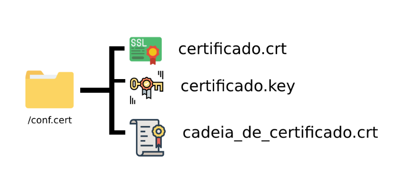

<h1 align=center>Docker</h1>
<h2>O que é o Docker?</h2>

O Docker, é uma virtualização que ocorre dentro do sistema operacional, mas executado como se fosse um processo! A diferença entre usar Docker e uma maquina virtual, é que no docker você não vai ter que instalar um outro sistema operacional
dentro do seu sistema, já que no Docker, ele é executado como um processo isolado,e graças a esse isolamento
é possível que cada aplicação tenha suas libs,dlls, de forma separadas, sem compartilhar ou depender de libs,,de 
outra aplicação.

<h2>Vantagens</h2>
<ul>
<li><b>Baixo consumo de hardware</b></li> utilização do hardware mais otimizada comparado com a VM.

<li><b>Portabilidade</b></li>O mesmo container vai ser executado em qualquer outra maquina da mesma forma.

<li><b>Reusabilidade</b></li>É possível utilizar o mesmo container para diversos ambientes.

<li><b>Microsserviços</b></li>Aderente a arquitetura de microsserviços.
</ul>
 

<h2>Arquitetura</h2>

<ul>
<li><b>Images</b></li>É um pacote com um sistema de arquivos com todas as suas dependências,libs de s.o,processos que serão executados,kernel,etc.

<li><b>Container</b></li>É o processo que executa uma imagem, a imagem é imutável mesmo após um container se iniciado.

<li><b>Registry</b></li> Repositório de imagens : <a href="hub.docker.com">hub docker</a> .
</ul>
 

<h2>Instalando o Docker</h2>

No nosso ambiente de laboratórios, estamos usando o Ubuntu, caso utilize outra distribuição verifique 
os requisitos : <a href="https://docs.docker.com/engine/install/">requisitos</a> ,
e então basta seguir o passo a passo desse link <a href="https://docs.docker.com/engine/install/ubuntu/">passo a passo de instalação</a> ,
vou deixar aqui o script para facilitar o processo, mas é o mesmo que está na documentação, recomendo que leia.

    #!/bin/bash

    apt-get remove docker docker-engine docker.io containerd runc -y

    apt-get update
    apt-get install -y\
        ca-certificates \
        curl \
        gnupg \
        lsb-release 

    mkdir -m 0755 -p /etc/apt/keyrings
    curl -fsSL https://download.docker.com/linux/ubuntu/gpg | gpg --dearmor -o /etc/apt/keyrings/docker.gpg

    echo \
    "deb [arch=$(dpkg --print-architecture) signed-by=/etc/apt/keyrings/docker.gpg] https://download.docker.com/linux/ubuntu \
    $(lsb_release -cs) stable" | tee /etc/apt/sources.list.d/docker.list > /dev/null

    apt update

    apt-get install docker-ce docker-ce-cli containerd.io docker-buildx-plugin docker-compose-plugin docker-compose -y

    systemctl start docker
    systemctl enable docker

<h2>Processo pós-instalação</h2>

Gerencie o Docker como um usuário não root, o daemon do Docker se liga a um socket Unix, e não a uma porta TCP. Por padrão, é o usuário root que possui o soquete Unix e outros usuários só podem acessá-los usando <b>sudo</b>. O daemon do Docker sempre é executado como usuário root.

<i>Se você deseja iniciar o Docker sem usar o sudo, crie um grupo chamado <b>docker</b> e adicione usuários a ele.</i>

Criando o grupo e adicionando seu usuário:
<dl>
  <dt>1 - Crie o grupo docker</dt>
  <dd>sudo groupadd docker</dd>
  <dt>2 - Adicione seu usuário ao grupo docker</dt>
  <dd>sudo usermod -aG docker $USER</dd>
  <dt>3 - Faça logout da maquia e logue novamente, se estiver usando uma VM, é preciso reiniciar. Você pode também ativar as alterações com o comando </dt>
  <dd>newgrp docker</dd>
  <dt>4 - Verifique se você pode executar o docker sem usar o sudo</dt>
  <dd>docker run hello-world</dd>
</dl>

<h2>Visão geral - Docker - Container</h2>

<h2>O que é um Container?</h2>

Simplificando, um container é um processo de area restrita em sua maquina, isolado de todos os processos da sua maquina. Esse isolamento aproveita namespaces do kernel, recursos que estão no Linux há muito tempo. O Docker trabalhou para tornar esses recursos acessíveis e fáceis de usar, resumindo um container :
<ul>
<li>É uma instancia executavel de uma imagem, você pode criar, iniciar, parar, mover ou excluir um container usando o DockerAPI ou CLI.</li>
<li>Pode ser executado em maquinas locais, maquinas virtuais ou implantado em nuvem.</li>
<li>É portátil, podendo ser executado em qualquer sistema operacional.</li>
<li>Esta isolado de outros containers, e executa seu próprio software, binários e configurações.</li>
</ul>

<h2>O que é uma imagem de container?</h2>

Ao executar um container, ele usa um sistema de arquivos isolado, esse sistema de arquivos personalizado, é fornecido por uma imagem do container, como a imagem contem o sistema de arquivos do container, ela deve conter tudo o que é necessário para executar um aplicativo, todas as dependências, configurações,scripts, binários,etc. A imagem contém outras configurações, como variáveis de ambiente, um comando padrão para executar e outros metadados.

<h2>Containerizar uma aplicação</h2>

Aqui vou mostrar como cria um container de uma aplicação web com o Apache, pegando nossa imagem através do Docker hub. Certifique-se de estar conectado a internet, e rode o comando <b>docker pull ubuntu/apache2</b>, vamos utilizar como base o Ubuntu, com o Apache2. Você pode verificar se a imagem foi baixada, utilizando <b>docker images</b>, tendo o retorno : 
<i><b>ubuntu/apache2               latest    edd92437b7eb   22 hours ago    179MB</b></i>

O que vamos criar aqui é um webserver Apache, capaz de testar certificados do tipo SSL.

   

<h2>Montando nosso laboratório</h2>

Dentro da sua pasta raiz, crie os diretórios :
<li>conf.cert</li>
Dentro dele, você vai colocar os seus certificados do SSL, normalmente são .crt .key e um bundle.crt . Esse diretório sera vinculado a um diretório no nosso container, que será o <b>/etc/apache2/ssl/</b>
 Nossa conf.cert terá essa estrutura :

Tendo nossa imagem ubuntu/apache2 baixada, vamos criar o nosso container que : 
<ul>
<li>Terá um diretório local do seu host, vinculado ao container.</li>
<li>Iremos fazer um redirecionamento de portas, da 80 do container para a 8030 do seu host.</li>
</ul>
<b>Obs.: Iremos precisar fazer algumas configurações no container em execução, para que tudo funcione corretamente.</b>

Rode o comando a seguir para criar o container : 

docker run -dit --name web_ssl_lab -p 8030:80 -p 8443:443 --mount type=bind,src="$(pwd)",target=/etc/apache2/ssl ubuntu/apache2

 
<ul>Explicando cada parte do comando:
<li><b>docker run</b>, para executar o container.</li>
<li><b>-dit</b>, para indiciar que vai ser iniciado em segundo plano de forma interativa.</li>
<li><b>--name web_ssl_lab</b>, definimos um nome para o container "web_ssl_lab".</li>
<li><b>-p 8030:80</b>, um forwarded de portas, da 80 do container, para a 8080 do host.</li>
<li><b>-p 8443:443</b>, para poder acessar no porta 443 sem erros.</li>
<li><b>--mount type=bind</b>, essa opção informa ao Docker para criar um ponto de montagem de ligação.</li>
<li><b>src</b>, o seu diretório de trabalho.Você pode tanto usar a variável como no exemplo, ou passar o path src=/seu/path .</li>
<li><b>target</b>, o diretório do container</li>
<li><b>ubuntu/apache2</b>, o nome da nossa imagem.</li>
</ul>
 

Se tudo tiver corrido bem, ao rodar o comando <b>docker ps</b>, você terá o retorno do container em execução.

<h2>Acessando o container</h2>

A partir de agora iremos acessar o container em execução e fazer nossas configurações, será necessário instalar :
<ul>
<li>openssl</li>
<li>curl</li>
<li>net-tools</li>
<li>apt-get --reinstall install ssl-cert</li>
</ul>
Essas aplicações são para garantir de não termos erros daqui pra frente. Logue como root, usando <b>su root</b>, e verifique se a montagem de diretório correu bem, <b>ls -lha /etc/apache2/ssl/</b>, se deu certo, você vai conseguir ver os arquivos da sua conf.cert . 

<h3>Configurando vhosts</h3>

Iremos trabalhar com vhosts e consequentemente com SSL, rode o comando <b>a2enmode ssl</b>, vai pedir para dar reload, rode então <b>service apache2 reload</b>,rode novamente o a2enmod ssl, agora vamos configurar o vhost, basta copiar o arquivo abaixo e adicionar ao <b>/etc/apache2/sites-available/default-ssl.conf</b>

    <VirtualHost *:443>
      ServerName seu.dominio.com.br
      DocumentRoot /var/www/html

      # SSL Configuration
      SSLEngine On
      SSLCertificateFile /etc/apache2/ssl/conf.cert/certificado.crt
      SSLCertificateKeyFile /etc/apache2/ssl/conf.cert/certificado.key
      SSLCertificateChainFile /etc/apache2/ssl/conf.cert/cadeia_de_certificado.crt

      # Other Apache Configuration
      ErrorLog ${APACHE_LOG_DIR}/error.log
      CustomLog ${APACHE_LOG_DIR}/access.log combined

      <Directory /var/www/html>
          Options Indexes FollowSymLinks
          AllowOverride All
          Require all granted
      </Directory>
    </VirtualHost>

Em ServerName informe o seu dominio que quer acessar, digamos que seu certificado seja *.uol.com.br, então seu dominio pode ser teste.uol.com.br . As 
configurações de path do ssl, de acordo com o nosso mapeamento. Salve o arquivo,e rode os comandos <b>a2ensite default-ssl.conf</b>, vai pedir para restart o apache, rode o reload, service apache2 reload(é melhor)

Se tudo tiver corrido perfeitamente sem erros, na sua maquina host você vai precisar adicionar esse host ao seu /etc/hosts, caso use Linux fica em <b>/etc/hosts</b> e caso use Windows <b>/windows/system32/drivers/etc/hosts</b>, seria dessa forma para adicionar : 172.17.0.2    teste.uol.com.br(lembrando que esse é um exemplo, adicione o host que você definiu). Agora acesse no seu navegador https://teste.uol.com.br:8030 , se der certo, a pagina do apache padrão vai ser carregada e você poderá ver o simbolo do cadeado referente ao https, clicando nele poderá ver o certificado e demais informações.

<b>Obs.: recomendo fazer o teste usando o Firefox!</b> 

<h2>Comandos Docker</h2>

Segue aqui alguns comandos :
<ul>

<h3 align=center>Gerenciamento de imagens</h3>
<li>docker images: lista todas as imagens disponíveis no sistema.</li>
docker pull <image-name>: faz o download de uma imagem do registro do Docker.</li>
<li>docker build -t <image-name> <path-to-dockerfile>: constrói uma imagem com base em um Dockerfile.</li>
<li>docker tag <source-image>:<tag> <target-image>:<tag>: cria uma nova tag para uma imagem existente.</li>
<li>docker push <image-name>: envia uma imagem para o registro do Docker.</li>

<h3 align=center>Gerenciamento de contêineres</h3>
<li>docker ps: lista todos os contêineres em execução.</li>
<li>docker ps -a: lista todos os contêineres, incluindo os que estão parados.</li>
<li>docker start <container-name>: inicia um contêiner parado.</li>
<li>docker stop <container-name>: interrompe um contêiner em execução.</li>
<li>docker restart <container-name>: reinicia um contêiner em execução.</li>
<li>docker rm <container-name>: remove um contêiner parado.</li>
<li>docker container prune: remove todos os contêineres parados.</li>

<h3 align=center>Gerenciamento de redes</h3>
<li>docker network ls: lista todas as redes disponíveis no sistema.</li>
<li>docker network create <network-name>: cria uma nova rede.</li>
<li>docker network connect <network-name> <container-name>: conecta um contêiner a uma rede.</li>
<li>docker network disconnect <network-name> <container-name>: desconecta um contêiner de uma rede.</li>

<h3 align=center>Outros comandos úteis</h3>
<li>docker exec -it <container-name> <command>: executa um comando dentro de um contêiner em execução.</li>
<li>docker logs <container-name>: exibe os logs de um contêiner em execução.</li>
<li>docker inspect <container-name>: exibe informações detalhadas sobre um contêiner.</li>
<li>docker volume ls: lista todos os volumes disponíveis no sistema.</li>
<li>docker volume create <volume-name>: cria um novo volume.</li>
<li>docker volume rm <volume-name>: remove um volume.</li>
</ul>
Esses são apenas alguns exemplos de comandos úteis do Docker. Consulte a documentação oficial do Docker para obter informações detalhadas sobre todos os comandos disponíveis.