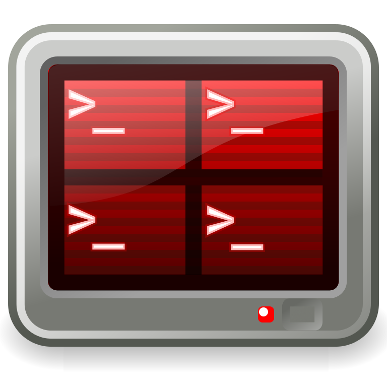
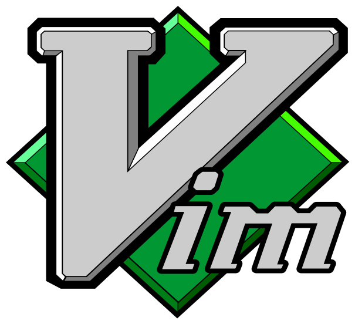
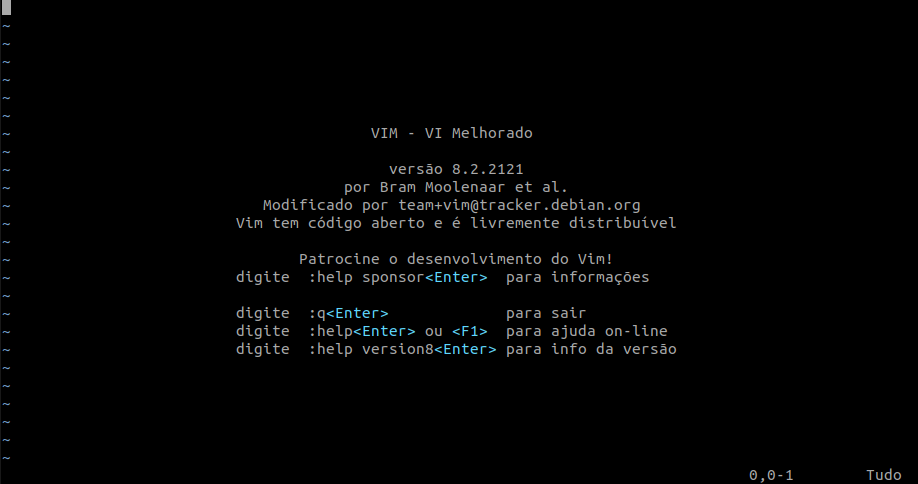
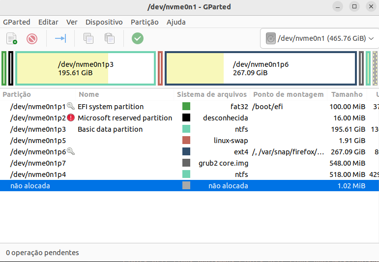
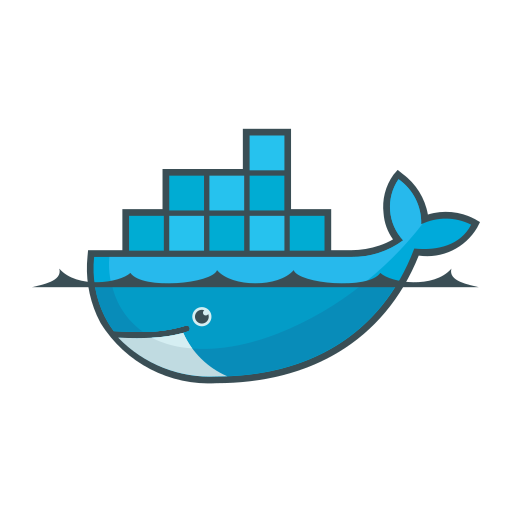

# O que instalar no S.O de alguém de infra

Vou listar aqui ferramentas que considero importante de ter instalado em meu ambiente de trabalho, atualmente utilizo Linux (Kali e Ubuntu 22).

- [Terminator](#terminator)
- [Vim](#vim)
- [Barrier-kvm](#barrier-kvm)
- [XCA](#xca---certificate-and-key-management)
- [Git](#git)
- [GParted](#gparted)
- [CFdisk](#cfdisk)
- [Docker](#docker)
- [Ansible](#ansible)
- [Anydesk e TeamViewer](#anydesk-e-teamviewer)
- [Remmina e xfreerdp](#remmina-e-xfreerdp)
- [Nmap | OpenVAS | Shodan](#nmap--openvas--shodan)

### Terminator

Permite que você ajuste a tela do seu terminal da forma que melhor lhe agradar, sem ter que abrir varios terminais separados.Mais informações<a href="https://gnome-terminator.org/"> aqui</a> .

        apt install terminator -y

### Vim

Pra mim o melhor editor de textos para se usar no terminal, depois que você migra pro Vim, não tem como voltar a usar o nano. Mais informações <a href="https://www.vim.org/"> aqui </a>.

        apt install vim  -y

### Barrier-kvm

Uma alternativa gratuita ao Synergy, o Barrier você consegue compartilhar o mesmo teclado e mouse com varios dispositivos na mesma rede, ideal quando trabalhamos com notebook e desktop em paralelo e independente do S.O. Mais informações <a href="https://github.com/debauchee/barrier"> aqui </a>.

        apt install barrier -y

        ou

        snap install barrier-kvm

<b>Se atente a instalar de preferência a mesma versão nos demais dispositivos</b>

### XCA - Certificate and Key management

É uma ferramenta que permite você gerenciar certificados, extrair dados, incluindo até criptografados .pfx , mais informações <a href="https://hohnstaedt.de/xca/"> aqui </a>.

        apt install xca -y

<b>Claro que também podemos fazer isso usando o openssl. </b>

### Git

Cara, sempre vai ter alguém que vai apagar aquele arquivo rc.local onde você subia suas gambiarras e você tem que refazer e as vezes pode nem lembrar, então aprenda a usar git e a versionar tudo que for importante no seu ambiente.

        apt install git -y

### GParted

Gosto de usar o GParted quando se trata de mexer com partições de disco, ainda mais em ambientes de produção! Mais informações <a href="https://gparted.org/download.php"> aqui </a> .

        apt install gparted -y

<b>Também tem a opção o cfdisk para usar via cli ou fdisk</b>

### CFdisk

É que nem que igual ao fdisk, só que melhor! Apenas acho melhor.

### Docker

Nos dias de hoje é quase impossivel viver sem um container pra resolver um problema por menor seja, pra evitar de quebrar meu ambiente, prefiro usar container. Mais informações <a href="https://www.docker.com/"> aqui </a> .

        curl -fsSl https://get.docker.com | sh

### Ansible

Eu não sei vocês, mas eu não gosto de ter que ficar entrando em mais de 150 VMs para configurar a mesma coisa em cada uma, sendo que da pra automatizar, é como diz Buda "se ta no jogo é pra usar!".

### Anydesk e Teamviewer

 

Como trabalho com acesso remoto para suporte aos usuários, é sempre bom ter uma ou mais opções de ferramentas para acesso remoto, prefiro o TeamViewer!

- <a href="https://anydesk.com/pt"> Anydesk </a>
- <a href="https://www.teamviewer.com/pt-br/"> TeamViewer </a>

### Remmina e xfreerdp

Agora para acessar usando RDP, uso o Remmina e xfreerdp, a diferença é que o xfreerdp é via terminal.

- <a href="https://github.com/FreeRDP"> xfreerdp </a>
- <a href="https://remmina.org/"> Remmina </a>

### Nmap | OpenVAS | Shodan

O Nmap é uma ferramenta bastente util no meu dia-a-dia, quando precisamos saber quais IPs temos disponiveis numa faixa de rede, para mapear portas, assim como até descobrir possiveis vulnerabilidades.

O OpenVAS utilizo quando necessário para varrer um hosts especifico, segue a mesma ideia do nmap.

Shodan, é meu bichinho de Deus, não deixe seu server com usuario e senha admin/admin .

- <a href="https://nmap.org/"> Nmap </a>
        
        apt install nmap -y

- <a href="https://github.com/mikesplain/openvas-docker"> OpenVAS </a>

        docker run -d -p 443:443 -e PUBLIC_HOSTNAME=myopenvas.example.org --name openvas mikesplain/openvas

- <a href="https://www.shodan.io/"> Shodan </a>

        Você pode instalar se quiser, ou usar direto no navegador mesmo!