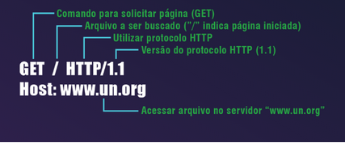
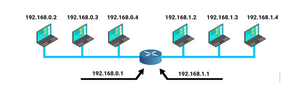

## Introdução a rede de computadores

<b>Aviso : esse conteudo foi baseado em todo primeiro semestre do curso de Sistemas de Internet pela faculdade Estácio de Sá</b>

O conceito de comutação de pacotes foi um dos responsáveis pelo grande sucesso da internet, que facilitou a conectividade e a rápida expansão das redes para uma escala global.

Nela os dados chamados de pacotes são os que carregam as informações da origem ao destino dentro da rede. Sendo encaminhados individualmente e de forma independente,cada ponto intermediário do percurso analisa as informações do pacote e decide por onde encaminhá-lo da rede até que ele alcance o destinatário final.

As redes são constituídas de 3 componentes fundamentais :
- Nós
- Enlace
- Protocolos(para saber sobre cada protocolo acessar <a href='https://www.opservices.com.br/protocolos-de-rede/'>aqui</a> )

- Os nós, representam os sistemas finais ou sistemas intermediários que são interconectados em rede. Sendo um equipamento circuito de terminação de dados(DCE),como um : modem, hub, ponte ou switch; ou um equipamento terminal de dados(DTE), como  : aparelho de telefone digital, uma impressora ou um computador host, por exemplo um roteador,uma estação de trabalho ou um servidor.

- Enlace, representa as ligações entre os nós da rede, como : fibra óptica, par trançado, cabo coaxial, transmissão em RF,micro-ondas, enlace satelital.

- Protocolos, são as regras de comunicação nas redes que organizam, automatizam a comunicação entre os nós e resolvem os problemas de transmissão, erros,controles, gerência,serviços e políticas.

A topologia de uma rede é representada pelo arranjo de ligação dos nós através dos enlaces, resultando em diferentes tipos de topologia. A topologia de uma rede tem influência no seu desempenho.

- Física é a organização, cabeamento e disposição das máquinas.
- Lógica, examina e organiza a forma como a rede desempenha seu trabalho, encontrando a melhor forma de conectar os nodes da rede, tendo um tráfego mais eficiente.

Tipos de topologias
- Anel
- Árvore
- Barramento
- Estrela
- Híbrida
- Malha
- Ponto-a-ponto

Para ver detalhadamente cada um, segue o link Tipos de <a href='https://docs.google.com/document/d/1ZoFjVUpbMIpMX27RvjG5fKIjAyeB4VB0kvdK4VEN3mg/edit'>topologias</a> .

Algumas delas são mais estáveis e mais caras, enquanto outras mais acessíveis e vulneráveis. A topologia escolhida impacta diretamente o custo da estrutura, representando a compra de cabos, hubs,switches para comportar o layout desejado.

As redes são classificadas quanto a região ou área física em que são dispostas para prestarem serviços aos usuários.

- LAN
- MAN
- WAN
- WLAN
- WMAN
- SAN
- PAN

Acesse <a href='https://tahtec.com.br/quais-sao-os-principais-tipos-de-redes-de-computadores/'>Tipos de redes</a> para mais detalhes sobre cada uma.

Também classificamos as redes em 2 grandes grupos de acordo com o tipo de meio físico usado para interconectar :

- Redes cabeadas : par trançado e cabo coaxial transportam o sinal eletromagnético ,fibra óptica é propagado na forma de luz.
- Redes sem fios : O sinal é transmitido em espaço aberto, não guiado, com diversas facilidades em relação às cabeadas, como rapidez na instalação, capacidade de mobilidade, pouco ou nenhum impacto sobre a infraestrutura predial.

        A tecnologia dominante empregada em redes locais sem fio é a tecnologia wi-fi, identificada pelo padrão IEEE 802.11.

<b>Modelos de camadas,modelo OSI e TCP/IP <a href='https://docs.google.com/document/d/1YkkTJ9XoNJLQW3YOhqcOSnACra-5cpfLhtzpZ82mUwQ/edit'>acessar Modelos</a> OSI e TCP/IP</b>

### Camadas de aplicação e transporte 

Vamos analisar os seguintes conceitos, quando realizamos uma compra com cartão de crédito ou débito em um estabelecimento comercial, é fundamental a existência de uma rede de comunicação, já que ela será o alicerce para execução da operação.
 
Ao inseri-lo na máquina de cartão, precisamos colocar uma senha para confirmar a operação. Tal dado é inserido no sistema por meio de um software executado nesta máquina, sendo executado na cama da aplicação. 

É a nossa interface com o sistema e com toda a rede que suporta essa operação, outros exemplos de softwares de aplicação são :

- Navegador web
- Cliente de e-mail
- Jogos executados em rede

Ressaltamos que a camada de aplicação é aquela de mais alto nível do modelo OSI, fazendo a interface com os usuários do sistema e realizando as tarefas que eles desejam.

Na arquitetura de aplicações, para desenvolvermos uma aplicação, não basta apenas conhecer uma linguagem e suas bibliotecas, antes disso é preciso definir qual arquitetura terá sua aplicação, sendo as mais conhecidas a :

- Cliente-servidor
- peer-to-peer(P2P)

Na arquitetura cliente-servidor, há pelo menos duas entidades : um cliente e um servidor.
 O servidor executa operações continuamente aguardando por requisições. Quando chega uma solicitação, o servidor pode :

- Atender imediatamente caso esteja ocioso;
- Gerar um processo-filho para o atendimento da solicitação;
- Enfileirar a solicitação para ser atendida mais tarde;
- Criar uma thread para esse atendimento

#### Processo-filho

Um processo é um programa em execução que inclui sua região de memória, os valores das variáveis e seu contexto de hardware. Um processo-filho é criado quando determinado processo se duplica em memória e entrega à sua cópia (seu filho) uma tarefa a ser executada.

#### Thread

Linhas de execução independentes que executam concorrentemente dentro de um processo. Quando funções são executadas como threads dentro dele, isso é feito de forma concorrente, compartilhando objetos e variáveis.
Independente do momento em que uma solicitação é processada, o servidor, no final, envia ao cliente uma mensagem contendo o resultado do processamento. Quem utiliza esse tipo de arquitetura é a aplicação web.
O que determina se uma entidade é cliente ou servidor, é a função desempenhada pelo software, e não o tipo de equipamento. É fundamental saber que, os servidores desempenham uma função muito  importante, por isso, há equipamentos apropriados para eles, como MTBF alto e recursos redundantes.
O tipo de software instalado neste equipamento é o responsável por determinar se ele é cliente ou servidor.
Além disso,um processo pode atuar simultaneamente como cliente e servidor.

Enquanto no peer-to-peer(P2P), existe uma distinção bem clara entre os processos que trocam informações na arquitetura cliente-servidor, na P2P todos os processos envolvidos desempenham funções similares.
Uma aplicação amplamente utilizada na internet é o sistema de compartilhamento de arquivos bittorrent. Baseado na arquitetura p2p, este sistema permite que seus usuários compartilhem arquivos sem haver a necessidade de eles estarem armazenados em um servidor.
Para que uma aplicação possa trocar dados com outra, é necessário definir um protocolo de aplicação. Um protocolo, define como os processos de uma aplicação que funciona em sistemas finais diferentes,passam mensagens entre si, em particular um protocolo de camada de aplicação define :

- Os tipos de mensagens trocadas, por exemplo, de requisição e de resposta;
- A sintaxe dos vários tipos de mensagens, tais como os campos da mensagem e como os campos são delineados;
- A semântica dos campos, isto é o significador da informação nos campos.
- Regras para determinar quando e como um processo envia e responde mensagens.
 

Enquanto o algoritmo da camada de aplicação determina seu funcionamento no ambiente local , o protocolo dela permite estipular tudo que é necessário para que aplicações em diferentes hospedeiros, possam trocar mensagens de maneira estruturada.

#### Camadas de aplicação na internet

- HTTP(Serviço web) : É o protocolo padrão para  transferência de páginas web na internet. A web foi idealizada no CERN, como uma forma de fazer com que grupos de cientistas de diferentes nacionalidades  pudessem colaborar por meio da troca de informações baseadas em hipertextos. 

#### Como esse protocolo é constituído?
- Etapa 1 : Uma página web típica é um conjunto com formato .html que pode conter imagens e outros tipos de objetos, como vídeos, texto, som, etc.

Para exibir determinada página web, o usuário digita no browser o endereço no qual ela se encontra, indicando o local em que deve ser buscada. Para que uma página seja transferida de um servidor para o browser, um padrão deve ser seguido pelos softwares, Ele especifica como o client solicita a página e o servidor a transfere.

- Etapa 2 : Esse padrão é o protocolo HTTP, a mensagem HTTP, por sua vez, é carregada pelo outro protocolo TCP/IP. Uma interação entre cliente e servidor se inicia quando ele envia uma requisição a um servidor, a solicitação mais comum consiste em : 
Enviar um texto em formato ASCII
Iniciar com a palavra GET
Inserir página solicitada, protocolo utilizado na transferência de servidor a ser encontrado.
Analisando os conceitos na prática, para solicitar a pagina web da ONU, utilizando o protocolo TCP, o browser estabelece uma conexão TCP com o servidor web situado no endereço www.un.org e lhe envia a seguinte solicitação:

Ao receber a solicitação, o servidor busca a página web solicitada, a transfere para o cliente e após confirmada a entrega, encerra a conexão. Como o HTTP utiliza o TCP, não é necessário se preocupar com questões de confiabilidade na entrega dos dados. 

### Correio eletrônico(e-mail) :

Os primeiros sistemas de correio eletrônico foram concebidos como um simples sistema voltado para a troca de arquivos. o Destinatário da mensagem era especificado na primeira linha do texto. Bastava então que o sistema procurasse ali para quem a mensagem deveria ser entregue, porém com o passar do tempo, surgiram novas necessidades que dificilmente eram atendidas por ele.

Em 1982, ainda na era da ARPANET, foram publicadas as RFCs 821 e 822, definindo respectivamente o protocolo de transmissão a ser utilizado e o formato da mensagem. Entretanto, apesar de ambas resolverem o problema inicial a que se propunham, elas especificavam que todo texto deveria ser composto pelo código ASCII

#### Como é construída a arquitetura do correio eletrônico?
É construída com base em 2 agentes :

- Usuário
- De transferência de mensagens

O agente de usuário, é o programa que faz a interface do usuário com o sistema de correio eletrônico, é por meio dele que o usuário : 

- Faz o envio e o download de mensagens e anexos
- Lê as mensagens
- Realiza a pesquisa, o arquivamento e o descarte de mensagens
- Escrever suas mensagens
- Anexa arquivos

A exemplo temos : Mozilla Thunderbird, Microsoft outlook,Eudora
Já os agentes de transferência de mensagens são os responsáveis por fazer com que elas cheguem até o destino. Eles são mais conhecidos como servidores de correio eletrônico.
 Postfix, Zimbra,Exchange.

 

Importantes características dos protocolos apresentados :

- SMTP : O protocolo responsável pela transferência da mensagem até seu destino é o SMTP. Ele utiliza o protocolo de transporte TCP, obtendo, assim, a garantia de que ela será entregue no destino sem erros.

O servidor SMTP aguarda por conexões de seus clientes. Quando uma conexão é estabelecida, o servidor inicia a conversação enviando uma linha de texto na qual se identifica e informa se está pronto (ou não) para receber mensagens. Se ele não estiver, o cliente deverá encerrar a conexão e tentar novamente mais tarde.

Caso o servidor esteja acessível, o cliente precisa informar aos usuários a origem e o destino da mensagem. Se o servidor considerar que se trata de uma transferência válida, sinaliza para que ele a envie. Após o envio, o servidor confirma sua recepção e a conexão é encerrada.

Como o SMTP é responsável somente pela entrega da mensagem no servidor destino, isso requer a utilização de outro protocolo de modo que o cliente possa buscar suas mensagens no mailbox.

- POP3 : Tem a finalidade de fazer o download das mensagens que se encontram no mailbox do usuário para o sistema local. Caso estejam neste sistema, ele pode utilizá-las em qualquer momento, mesmo sem ter conexão com a internet.

O POP3 é implementado na maioria dos agentes de usuário. Basta configurar os parâmetros de conta e senha do usuário para que o agente faça o download das mensagens. Ele permite o download seletivo delas, assim como apagar as selecionadas no servidor. 

- IMAP :Assim como o POP3, o IMAP (internet message access protocol) permite que um usuário tenha acesso às mensagens armazenadas em sua caixa. Porém, enquanto o POP3 é baseado na transferência delas para o sistema local a fim de serem lidas, o IMAP consegue permitir sua leitura diretamente no servidor, dispensando, portanto, a transferência para o sistema local.

Isso será particularmente útil para usuários que não utilizarem sempre o mesmo computador, pois isso permite que suas mensagens possam ser acessadas a partir de qualquer sistema.O IMAP também fornece mecanismos para criar, excluir e manipular várias caixas de correio no servidor.

<b>Atenção</b>

- Um webmail não é um protocolo, mas uma forma oferecida por alguns sites da web a fim de que os usuários possam ler suas mensagens de correio eletrônico.Para usar o sistema, o usuário abre uma página web, na qual entra com uma identificação e uma senha. A partir desse momento, ele tem acesso imediato às suas mensagens (de forma parecida com a de um cliente IMAP)

### DNS(Domain Name System)

A comunicação entre hospedeiros na internet ocorre por meio de endereços binários de rede. Afinal, para se comunicar com um destino, o hospedeiro precisa conhecer seu endereço. Entretanto, é bem mais fácil trabalhar com nomes de hospedeiros do que com seus endereços de rede. Além de ser muito difícil conhecer todos os endereços dos hospedeiros com os quais precisamos trabalhar, precisamos ser notificados toda vez que algum deles mudasse de endereço.

Para resolver esse problema, foi desenvolvido o domain name system (DNS). Sua finalidade é a criação de um sistema de nomes de forma hierárquica e baseada em domínios. Para acessar um hospedeiro, portanto, basta conhecer seu nome de domínio e fazer uma consulta ao servidor DNS, que é responsável por descobrir seu endereço.

Além do mapeamento de nomes de hospedeiros em endereços IP, o DNS ainda provê:

- Identificação de servidores de correios eletrônicos;
- Apelidos para hospedeiros;
- Distribuição de carga;
- Descoberta de nomes de hospedeiros (mapeamento reverso).

#### Espaço de nomes

O espaço de nomes do DNS é dividido em domínios estruturados em níveis. Confira a organização do primeiro nível:

Os domínios genéricos informam o tipo de organização ao qual o domínio está vinculado. Alguns exemplos são:

- .com = comercial;
- .edu = instituições educacionais;
- .int = algumas organizações internacionais;
- .org = organizações sem fins lucrativos.

Os domínios de países, por sua vez, possuem uma entrada para cada país. Alguns exemplos são:

- .br = Brasil;
- .pt = Portugal;
- .jp = Japão;
- .ar = Argentina.

Cada domínio tem seu nome definido pelo caminho entre ele e a raiz, enquanto seus componentes são separados por pontos.

Cada domínio controla como são criados seus subdomínios. Para a criação de um novo domínio, é necessária apenas a permissão daquele no qual será incluído. Não há qualquer restrição sobre a quantidade de subdomínios que podem ser criados dentro de um domínio. Os nomes de domínio não fazem distinção entre letras maiúsculas e minúsculas.

EDU e edu, por exemplo, são o mesmo.

Os nomes de componentes podem ter até 63 caracteres, enquanto os de caminhos completos não podem ultrapassar os 255. O DNS é implementado sobre o protocolo UDP (user datagram protocol). Trata-se de um protocolo do nível de transporte que não garante a entrega dos dados no destino. Dessa forma, cabe ao software DNS garantir uma comunicação confiável.

### Resolução de nomes

O espaço de nomes do DNS é dividido em zonas. Independentes, elas possuem um servidor de nomes principal e pelo menos um de nomes secundário:

- Servidor de nomes principal: Configurado com as informações das zonas sob sua responsabilidade, ele faz o repasse delas para os servidores de nomes secundários;
- Servidor de nomes secundário: Responde pelas zonas caso haja uma falha do servidor de nomes principal.
As zonas do DNS definem o que um servidor deve resolver. Se ele for o responsável pela zona pesquisada (servidor autoritativo), deverá fazer a resolução solicitada.

### Três principais componentes do DNS

- Registros de recursos armazenados em um banco de dados distribuído;
- Servidores de nomes DNS responsáveis pela manutenção de zonas específicas;
- Solucionadores DNS em execução nos clientes.

Mais informações sobre DNS, acesse  <a href='https://www.lacnic.net/774/3/lacnic/domain-name-system-_-dns'>DNS</a>

- Para que serve a camada de transporte?

Executadas na camada de aplicação, as aplicações precisam de um modelo de rede no qual haja a entrega de uma mensagem(ou fluxo de dados) tanto em um ponto de rede quanto em sua aplicação par no hospedeiro destino.
O objetivo da camada de transporte é, independentemente das redes físicas em uso, promover a confiabilidade na transferência de dados entre os hospedeiros de origem e destino.

Essa camada deve oferecer um serviço de transferência confiável, embora caiba a aplicação decidir sobre o seu uso.
Em uma arquitetura de camadas, podemos afirmar que o objetivo geral de uma camada é oferecer serviços aquela imediatamente superior. No caso da camada de transporte, sua pretensão é oferecê-los a camada de aplicação.

<b>Atenção
Lembre-se de que, em nosso estudo, estamos considerando a arquitetura TCP/IP, na qual não existem as camadas de sessão e de apresentação. Como um dos principais objetivos da camada de transporte é ofertar um serviço confiável e eficiente a seus usuários, ela precisa oferecer, no mínimo, um serviço orientado à conexão e outro sem conexão.</b>

Para atingir esse objetivo, a camada de transporte utiliza os serviços oferecidos pela rede. No serviço de transporte orientado à conexão (serviço confiável), existem três fases:

- Estabelecimento de conexão
- Transferência de dados
- Encerramento de conexão

Por meio de um controle apurado da conexão, esse serviço de transporte consegue verificar quais pacotes chegaram com erro ao destino e até mesmo aqueles que não foram enviados, sendo capaz de retransmiti-los até que os dados estejam corretos.

Já no serviço de transporte sem conexão, não existe nenhum controle sobre os pacotes enviados. Se um deles se perder ou chegar ao destino com erro, nada será feito para obter a sua recuperação.

- Se a rede oferece um serviço com que garanta uma entrega sem erros, por que uma aplicação optaria por um serviço sem essa garantia?

A resposta é simples: por questões de desempenho. 
Pelo fato de ser preciso cuidar de cada pacote no serviço orientado à conexão, verificando-os e retransmitindo-os em caso de necessidade, esse controle gera um overhead. Como nada disso é feito no serviço sem conexão, os pacotes são entregues no destino de forma mais simples e rápida.

- Aplicações como transferência de arquivos e e-mail exigem que seus dados cheguem ao destino livres de erros. Dessa forma, elas utilizam um serviço orientado à conexão.

- Ainda assim, em certas aplicações, o mais importante é a chegada a tempo de uma informação, mesmo que ela contenha erros ou que a mensagem anterior tenha se perdido.

- No serviço de telefonia em rede, por exemplo, o atraso na transmissão tem um efeito pior que um pequeno ruído causado pela eventual perda de pacote.

### Endereçamento

- Quando seu programa solicita algo a um servidor, o sistema envia uma mensagem para ser entregue à aplicação que executa em um hospedeiro remoto. Mas podem existir várias aplicações nele.

- Como identificamos uma aplicação específica?

Surge neste momento o endereçamento no nível de transporte. Sua função é identificar em qual aplicação determinada mensagem deve ser entregue. Afinal, toda mensagem do protocolo de transporte carrega o endereço da aplicação. Estudaremos mais adiante TCP e UDP, dois protocolos da camada de transporte da arquitetura TCP/IP. Neles, o endereço de transporte é conhecido como porta.

- Um processo pode ter um ou mais endereços de transporte (conhecidos como portas na arquitetura TCP/IP) pelos quais dados passam da rede para o processo – e vice-versa. Desse modo, a camada de transporte do hospedeiro destino os entrega diretamente a uma porta.Para que uma aplicação possa acessar outra remota, é necessário conhecer o endereço do hospedeiro no qual ela se encontra. Ele serve, portanto, para que se consiga chegar ao hospedeiro remoto.

- Como o protocolo de transporte do destino consegue saber para qual de suas aplicações deve entregar a mensagem? A resposta é o conceito de porta, que é responsável por identificar a aplicação no destino.

- Para que um pacote chegue à aplicação de destino, é necessário que o transmissor saiba, de alguma forma, em que porta a aplicação está esperando a chegada do pacote. 

- Para facilitar o trabalho dele, algumas aplicações esperam seus pacotes sempre em uma mesma porta: a “porta conhecida” da aplicação.

<table>
<tr>
<th>PORTA</th>
<th>APLICAÇÃO</th>
</tr>
<tr>
<td>7</td>
<td>echo</td>
</tr>
<tr>
<td>20</td>
<td>ftp-data</td>
</tr>
<tr>
<td>21</td>
<td>ftp</td>
</tr>
<tr>
<td>22</td>
<td>ssh</td>
</tr>
<tr>
<td>23</td>
<td>telnet</td>
</tr>
<tr>
<td>25</td>
<td>smtp</td>
</tr>
<tr>
<td>53</td>
<td>domain</td>
</tr>
<tr>
<td>69</td>
<td>tftp</td>
</tr>
<tr>
<td>110</td>
<td>pop-3</td>
</tr>
<tr>
<td>119</td>
<td>nntp</td>
</tr>
<tr>
<td>161</td>
<td>snmp</td>
</tr>
<tr>
<td>162</td>
<td>snmp-trap</td>
</tr>
<tr>
<td>443</td>
<td>https</td>
</tr>
</table>

### CONSIDERAÇÕES FINAIS

Vimos que, na camada de aplicação, são executadas as aplicações que os usuários desejam executar. Além disso, pontuamos que um desenvolvedor precisa se basear em um estilo de arquitetura para desenvolver seu software de aplicação.

Quando houve a apresentação da camada de transporte, também pudemos observar que existem dois serviços básicos: sem e com conexão. O desenvolvedor da aplicação precisa definir que tipo de serviço mais se adequa a seu projeto.
Dessa forma, consideramos haver um forte relacionamento entre a camada de aplicação e a de transporte, pois o tipo de serviço de transporte escolhido pelo desenvolvedor gera um impacto direto no projeto da aplicação.

### Camada de Rede

No modelo OSI, a camada de rede fica acima da camada de enlace. Onde a camada de enlace tem como objetivo organizar a comunicação em nível de enlace, ou seja, ela deve garantir que um hospedeiro consiga se comunicar com o hospedeiro vizinho. O objetivo da camada de rede é, a partir deste serviço, promover uma comunicação de âmbito global, permitindo que a informação que sai de um hospedeiro chegue a seu destino não importando em qual local da rede esteja este destino.
Para isso ele realizar duas grandes funções :
Define um esquema para o endereçamento que seja aceito por toda a grande rede
Realiza o roteamento

A quantidade máxima de dados que podem ser trocados entre entidades da camada de rede possui um tamanho limitado. Para isso, a camada de transporte deverá segmentar tais mensagens em partes menores e colocar cada segmento em uma unidade de dados da camada de rede,  denominados de pacotes.

A camada de rede cuida da transferência de pacotes desde a origem até seu destino.
Para realizar esta comunicação a camada de rede deve : 
Conhecer toda a topologia da sub-rede de comunicação
Escolher rotas que evitem sobrecarregar partes da rede enquanto outras ficam ociosas
Compatibilizar a comunicação entre os diferentes tipos de sub-redes existentes

#### A CAMADA DE REDE NA INTERNET

Na camada de rede, a Internet pode ser vista como um conjunto de sub-redes ou Sistemas Autônomos (SA) conectados entre si. Não existe uma estrutura real, mas diversos backbones que interligam redes regionais, que por sua vez estão conectadas às redes locais.
O protocolo que mantém a Internet unida é o protocolo de camada de rede IP (Internet Protocol). A tarefa do IP é fornecer a melhor forma de transportar datagramas da origem para o destino, independentemente de esses hospedeiros estarem na mesma rede ou em outras redes intermediárias.

- Datagramas : São unidades básicas de informações que passam pela Internet. Dentro do datagrama está seu cabeçalho, que contém informações sobre sua origem e seu destino, assim como informações sobre para qual protocolo o IP deverá passar os dados. Também fazem parte dele os dados que devem ser entregues à camada de transporte no destino.
- Fragmentos : São partes de um datagrama muito grande que foi quebrado em unidades menores. Como os dados precisam caber dentro da porção de dados da rede física, pode ser que seja necessário fragmentar os dados da aplicação para que eles possam ser transportados pela rede. O tamanho do fragmento é determinado pelo MTU da interface de hardware da rede. O IPv4 especifica que a fragmentação ocorre em cada roteador baseado na MTU da interface pela qual o datagrama IP deve passar.

#### ENDEREÇAMENTO IPV4
Um hospedeiro normalmente possui apenas uma interface com a rede de computadores. Quando o protocolo IP de um hospedeiro quer enviar um datagrama, ele o faz por meio dessa interface.

<b>A INTERFACE DE REDE É A FRONTEIRA ENTRE O HOSPEDEIRO E A REDE FÍSICA.</b>

Cada interface em cada hospedeiro da Internet precisa de um endereço IP globalmente exclusivo, ou seja, não pode haver duas interfaces com o mesmo endereço IP na Internet válida.
A figura, a seguir, fornece um exemplo de endereçamento IP e interfaces em que um roteador com 2 interfaces é usado para interconectar os 6 hospedeiros. Observando os endereços dos hospedeiros da esquerda e da interface do roteador que os liga, percebe-se que todos possuem endereço IP na forma 192.168.0.x, enquanto os hospedeiros e a interface do roteador localizados na parte direita da figura possuem endereço na forma 192.168.1.x.  Diz-se que cada uma destas redes que interconecta 3 hospedeiros mais a interface do roteador formam uma sub-rede.

Uma sub-rede é uma subdivisão lógica de uma rede IP. A subdivisão de uma rede grande em redes menores resulta num tráfego de rede reduzido, administração simplificada e melhor performance de rede. Como pode-se observar, no exemplo, os 3 campos mais à esquerda do endereço (formados por 24 bits) nunca mudam dentro da sub-rede. Deste modo, temos à esquerda a sub-rede 192.168.0.0/24 e à direita a sub-rede 192.168.1.0/24. O “/24” indica que os 24 bits mais à esquerda do endereço definem a sub-rede. 
O mecanismo que permite tal divisão é conhecido como máscara de rede.

As máscaras de rede, permitem dividir a rede em sub-redes menores, normalmente, as máscaras de sub-rede são representadas com quatro números entre 0 e 255, separados por pontos, ou, menos comum, como oito dígitos na representação hexadecimal.
255.255.255.0

#### PROTOCOLO DE CONTROLE DA INTERNET

O protocolo IP é o responsável por manter a unidade de toda a Internet, porém, ele não consegue realizar sozinho todo o trabalho necessário. Para auxiliá-lo nesta tarefa, foram desenvolvidos protocolos auxiliares na camada de rede, conhecidos como protocolos de controle.

Neste módulo, estudaremos os principais protocolos de controle que trabalham em conjunto com o protocolo IP.

#### ARP (ADDRESS RESOLUTION PROTOCOL)

o ARP tem como função dentro da rede, identificar o MAC adress de outra maquina da mesma rede, pois os switch trabalham com MAC Adress, então se a máquina 10.0.0.10 precisa se comunicar com o servidor 10.0.0.5,  a máquina 0.10 vai solicitar ao switch através do protocolo ARP uma “checagem” enviando a todas as portas um resquet para saber o mac adress da máquina 0.5, após isso, o servidor 0.5 retorna informando seu mac, assim a comunicação entre 0.10 e 0.5 vão se conectar. 
O switch possui uma tabela que consegue guardar IP e qual mac adress esta vinculado a ele, assim fazendo o endereçamento para o ip correto de maneira inteligente.

#### DHCP (DYNAMIC HOST CONFIGURATION PROTOCOL)

Para ter acesso à Internet, um hospedeiro precisa ser configurado com alguns parâmetros.
Os parâmetros mínimos a serem configurados são:

- Endereço IP : Para permitir que o hospedeiro possa ser endereçado e receber dados de outro hospedeiro
- Máscara de sub-rede : Para que o hospedeiro possa determinar qual a sua sub-rede
- Endereço do gateway(roteador) : Para que o hospedeiro possa enviar informações para fora da sua sub-rede
- Endereço do servidor DNS : Para que o hospedeiro possa acessar outros hospedeiros por seus nomes em vez de precisar conhecer seus endereços IP.

De modo geral, o DHCP permite três tipos de atribuição de endereços:
Configuração manual : O administrador especifica o endereço que cada hospedeiro receberá quando se conectar à rede.
Configuração automática : Permite que um servidor DHCP atribua um endereço quando um hospedeiro se conectar pela primeira vez a rede. A partir deste momento, esse endereço estará reservado para este hospedeiro para sempre
Configuração dinâmica : O servidor “empresa” um endereço  por um tempo limitado, quando o hospedeiro não estiver mais utilizando este endereço, ele poderá ser alocado a outro hospedeiro.

#### ICMP (INTERNET CONTROL MESSAGE PROTOCOL)

É um protocolo que comunica mensagens de erro, diagnóstico e outras condições que requeiram atenção em uma rede. 
No caso de mensagens de erro, são usadas para informar a um dispositivo transmissor que um erro ocorreu durante a transmissão do datagrama/pacote.
Nas mensagens de informação, permitem aos dispositivos trocarem informações entre si e realizarem determinados tipos de testes e diagnósticos. 

Exemplos do uso do ICMP é quando usamos ping ou traceroute,  Quando pingamos para um ip, os protocolos ARP por exemplo, vai tentar identificar o mac daquele ip, e no ICMP obtemos respostas quando o ip esta com algum erro, podemos ver isso usando o wireshark por exemplo.

#### Roteamento

A principal função da camada de rede é rotear pacotes do hospedeiro de origem para o hospedeiro destino da melhor forma possível. Na maioria dos casos, os pacotes precisarão passar por vários roteadores para chegar ao destino.
Mais informações sobre roteamento e os tipos, acessar <a href='https://webpovoa.com/roteamento-ip/'>Roteamento</a>

#### Camada Fisica

A camada física é responsável pela geração e transmissão do sinal propriamente dito, que é levado um transmissor ao receptor correspondente. Eles estão conectados por um enlace de transmissão.
Para ativar, manter e desativar o link físico entre sistemas finais, a camada fisica define especificações :

- Elétricas
- Mecânicas
- Funcionais
- De procedimentos

A partir disso, são determinadas características como :

- Níveis de voltagem
- Temporização de alterações de voltagem
- Taxas de dados físicos
- Distâncias máximas de transmissão
- Conectores físicos
- Outros atributos similares.

Essa camada está completamente associada ao hardware dos equipamentos e enlaces.

Pesquisar camada de enlace
Pesquisar segurança e monitoramento de rede

