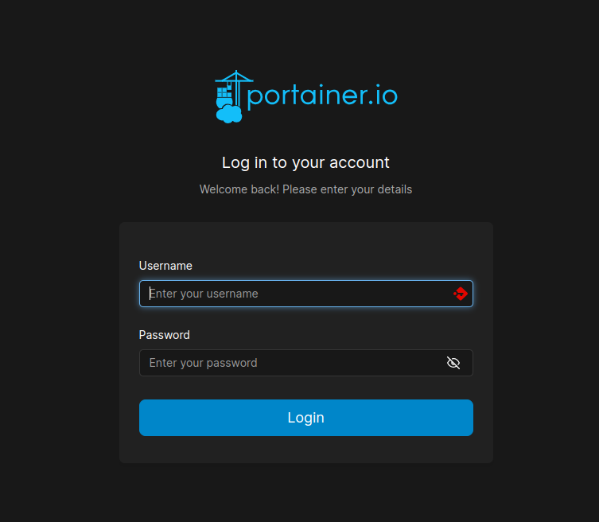
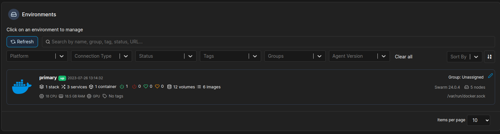
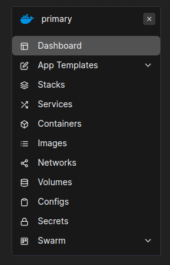

# Índice

## Sobre

O Portainer é uma aplicação que roda dentro de um container para gerenciar seus containers, olha só, tudo via interface web, basicamente tudo que você faz via CLI pode ser feito também pela GUI.

## Instalação

Para instalar temos 2 formas :

- standalone : para rodar apenas na maquina.
- swarm : para rodar dentro do cluster.

### Standalone

Muito simples e fácil :

    docker run -d -p 9000:9000 -p 9443:9443 --name portainer --restart=always -v /var/run/docker.sock:/var/run/docker.sock -v portainer_data:/data portainer/portainer-ce:latest

### Swarm

    docker service create --name portainer --publish 9000:9000 --constraint 'node.role == manager' --mount type=bind,src=//var/run/docker.sock,dst=/var/run/docker.sock portainer/portainer -H unix:///var/run/docker.sock

## Acesso

Para acessar, basta entrar ai no seu localhost(se estiver em standalone) ou num dos ips ai do seu cluster, apontando para a porta 9000

No primeiro acesso será necessário criar uma senha para o usuário de admin, como no mínimo 12 caracteres.
Uma vez logado, você verá a tela onde tem o seu cluster/ou containers, basta clicar para se conectar :

Você agora no menu lateral esquerdo terá todas as opções via interface web que você tem via CLI:

## Documentação

Sempre bom procurar saber como uma ferramenta funciona através da sua documentação oficial, segue o link <a href="https://docs.portainer.io/">aqui</a>