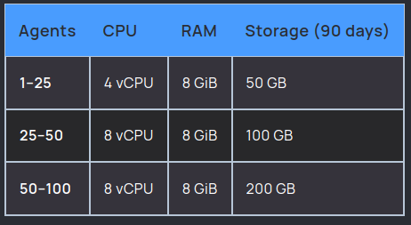
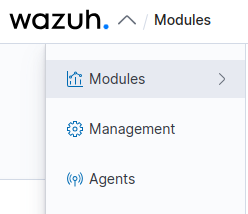
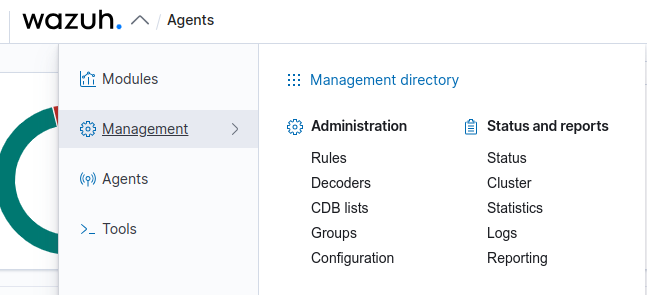

# Índice

- [Requisitos](#requisitos)
- [Instalação](#instalação)
- [Deploy dos Agents](#deploy-dos-agents)
- [Criar grupos](#criar-grupos)
- [Buscando logs](#buscando-logs)
- [Extra](#extra)

## Gerenciamento de Logs e Monitoramento de intrusão

Irei apresentar para vocês uma ferramenta onde é possível gerenciar logs tendo assim um servidor de logs externo/remoto, monitorar/detectar intrusões no seu sistema, nos seus servidores e entre outras coisas, essa ferramenta é o Wazuh !

## Requisitos

- Hardware - Depende da quantidade de endpoints que você quer monitorar e também por quanto tempo quer manter os logs, segue o que foi retirado da documentação oficial :

## Instalação

    curl -sO https://packages.wazuh.com/4.4/wazuh-install.sh && sudo bash ./wazuh-install.sh -a

Ao terminar a instalação se tudo correr bem, você verá essa informação onde tem a senha de acesso do admin :

    INFO: --- Summary ---
    INFO: You can access the web interface https://<wazuh-dashboard-ip>
        User: admin
        Password: <ADMIN_PASSWORD>
    INFO: Installation finished.

Mais informações sobre a instalação <a href="https://documentation.wazuh.com/current/quickstart.html">aqui</a> !

Uma vez instalado, acesse a dashboard com o login e senha informados e siga para o proximo tópico!

## Deploy dos Agents

Para fazer o deploy de agents, você vai na seta do lado do nome "WAZUH" que será aberto um sub-menu, e nele você vai ver a opção "Agents" clique nela , procure agora a opção "Deploy a new agent", na tela de deploy terá : 

<i>abaixo segue as informações da tela de deploy new agent</i>

    1 - Choose the Operate System : escolha entre Red Hat/CentOS | Debian/Ubuntu | Windows | MacOS

    2 - Choose the architecture : i386 | x86_64 | armhf | aarch64

    3 - Wazuh server address : vai estar como "localhost" informe o IP do server do Wazuh

    4 - Assign the agent to a group : você pode já informar para qual grupo o agent deve ser adicionado

    5 - Install and enroll the agent : copiar e colar 

    curl -so wazuh-agent-4.3.10.deb https://packages.wazuh.com/4.x/apt/pool/main/w/wazuh-agent/wazuh-agent_4.3.10-1_amd64.deb && sudo WAZUH_MANAGER='IP-DO-SERVER' WAZUH_AGENT_GROUP='SERVIDORES_PROD' dpkg -i ./wazuh-agent-4.3.10.deb

    6 - Start the agent : 

    systemctl daemon-reload
    systemctl enable wazuh-agent
    systemctl start wazuh-agent

## Criar grupos

É possível e recomendável criar grupos para uma melhor organização dos servidores que vão ser monitorados, podendo ter um filtro melhor. Para criar grupos, vá em "Management > Groups" , para adicionar um novo grupo clique em "Add new group", defina um nome para o grupo, e após isso, clique nele para entrar e poder administrar. 
 
Você pode gerenciar os agents que vão fazer parte deste grupo, indo em "Manage agents".

## Buscando logs

Particularmente gosto de criar meu próprio filtro de busca quando quero analisar algo num log coletado, indo em :

- Menu / OpenSearch Dashboards / Discover

A partir daqui, no menu lateral esquerdo tenho varias opções para poder adicionar e filtrar minha pesquisa, sempre opto por usar :

    agent.ip
    agent.name
    data.srcip
    data.srcuser
    role.groups
 

Com esses filtros já pode obter : nome e ip da maquina agent,qual o ip e usuario que acessou a maquina e qual das regras esta sendo usada para monitorar :  authentication,syslog, entre outras.

 

Você pode também ir direto no agent que quer analisar os logs e ir em alguns dos módulos :

- Security Events : relacionado a acessos, segurança
- Integrity Monitoring : relacioando a alteração de arquivos

## Extra

Vou deixar aqui o link da documentação oficial e também de um tutorial gratuito disponibilizado no YouTube :

- Documentação oficial : <a href="https://documentation.wazuh.com/4.3/getting-started/index.html">Clique aqui</a>
- Tutorial YouTube : <a href="https://www.youtube.com/playlist?list=PLYwuH4Jfk8_Gzwsvf0irpB0baCBX4t4cB">Clique aqui</a>